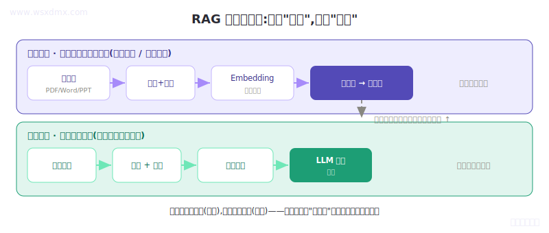

<div align="center">

# RAG Chain

**从零做出能上线的 RAG 系统,跟着代码学,完整开源**


<br/>



<em>一套 RAG 系统的完整架构:离线建库 + 在线问答 双链路</em>

</div>

---

## 这个项目是什么

### 给谁看?

**有编程基础(Python 会写、命令行能用)、但 RAG / Agent / 大模型应用零基础**的工程师。

- ❌ 不适合:完全不会编程的初学者
- ❌ 不适合:已经做过 RAG 项目的资深工程师
- ✅ 适合:**想转大模型岗、但被市面上「原理太抽象 / 代码太黑盒」的教程劝退的工程师**

### 跟市面上其他 RAG 教程有啥不一样?

| 维度 | 市面常见 RAG 教程 | 这个项目 |
|------|----------------|---------|
| 实现方式 | LangChain 封装,跑通了不知道为啥 | **双版本**:全手写版(学原理)+LangChain优化版(生产用) |
| 配套代码 | demo 玩具,clone 下来跑不通 | **完整可运行**,自带合成测试数据 |
| 内容深度 | 偏概念,缺真实工程经验 | **每章配真实项目踩坑**(核辐射条款、推销 vs 销售…) |
| 生产部署 | 无 | **LangChain 优化版含 API 服务+熔断保护+三级缓存** |
| 目标读者 | 含糊不清 | **明确「半小白」**:有编程基础 + RAG 零基础 |

---

## ⚡ 5 分钟跑起来

### 30 秒:先看一个真实事故(零配置,不用 key)

```bash
git clone https://github.com/MisterBooo/rag-from-zero.git
cd rag-from-zero/chapters/ch03-chunking
pip install -r requirements.txt
python reproduce-disaster.py
```

你会看到(这是真实生产事故的最小复现,输出是确定的):

```
=== 固定长度切分的事故现场 ===

Chunk 0: 本保险承保意外伤害导致的身故或残疾,但以下情况除外

Chunk 1: :(1)战争 (2)核辐射

=== 用户问:核辐射在保障范围内吗? ===
→ Chunk 0 只到'但以下情况除外'就断了,除外项全在 Chunk 1
→ 检索只命中 Chunk 0,模型看不到核辐射属于除外项
→ 模型理直气壮回答'在保障范围内' → 真实场景:理赔差点出大事
```

**这就是你将跟着学的真实工程问题** —— 不是 toy demo。一刀切坏了一句话,线上就出了理赔事故。

### 完整版:跑通一个真正的 RAG 系统

本项目提供**三种实现方式**：

| 实现方式 | 特点 | 适用场景 |
|----------|------|----------|
| [`rag_project/`](rag_project/) | 全手写实现，无框架依赖 | 学习底层原理 |
| [`rag_langchain/`](rag_langchain/) | LangChain 框架优化版 | 生产部署 |
| [`rag_Django/`](rag_Django/) | Django + LangGraph 企业版 | 企业级 Web 应用 |
